# Python: Main Info

## Abstracts

Общие сведения о языке Python

## Table of Contents

- [About Python](#About-Python)
- [Main features](#Main-features)
- [How it works](#How-it-works)
- [GIL](#GIL)
- [Annex A](#Annex-A)
- [Annex B](#Annex-B)
- [Bibliography](#References)

______________________________________________________________________

## About Python

Python это мощный и простой в изучении язык программирования.  
Он предлагает эффективные высокоуровневые структуры данных и простой, но эффективный подход к объекто-ориентированному программированию.  
Элегантный синтаксис, динамическая типизация и интерпретируемый тип делают его идельным языком для написания скриптов, а так же для быстрой разработки приложений под множество платформ.

Интерпретатор Python и обширная стандартная библиотека сводобно доступна как в качестве исходного кода, так и в бинарном виде для большинства платформ на оффициальном сайте Python и может свободно распространяться.  
На этом же сайте размещены дистрибутивы или ссылки на многие бесплатные сторониие модули, прочие инструменты, а так же ссылки на дополнительную документацию.

Python - это расширяемый (extensible) язык: в него можно добавить новые функции и типы данных, реализованные на C, C++ или других языках, которые можно вызывать из C.

Python может использоваться как язык для расширения приложений (embeeding).  
Его можно встроить в любое приложение написанное на C/C++(и не только) для написания скриптов, настройки и расширения функциональности приложения.

В официальном руководстве, в разделе Whetting Your Appetiate язык Python прежде всего позиционируется как язык для автоматизации относительно простых рутиных задач.
В этом контексте он противопоставляется компилируемым языкам программирования (c, c++, java) с акцентом на скорость разработки.
В качествеп преимуществ так же выделается "компактный синтаксис" - код получается лаконичным и читаемым.  
Читаемость достигается в том числе за счет семантически значимой индентации (no brackets and oth).
А так же за счет отсутвия необходимости в предварительном объявлении переменных (and arguments).

> [!NOTE]
> Это интересно!
>
> В Python термин Library используется только в словочетаниях Standart Library и External Library.  
> Standart Library включает в себя все built-in пакеты и модули, а External Library все внешние, соответственно.  
> Больше никаких библиотек в Python нет, только пакеты и модули.

> [!NOTE]
> Это тоже интересно!
>
> На русском мы говорим "условия" и "циклы" касательно if, for, while, etc описывая смысл.
> Формально всё это statements - интрукции (синтаксическая категория).
> Вообще все, что пишется в коде делится только на statements и expressions

______________________________________________________________________

## Main features

**Динамиечская типизация**
Тип переменной определяется во время выполнения, а не компиляции:

```python
x = 10      # int
x = "text"  # теперь str
```

**Сильная типизация**
Python не выполняет неявные приведения между несовместимыми типами:

```python
"2" + 3  # TypeError

# Исключение
"2" * 3 # "222"
```

**Утиная типизация**
Объекты используются по их поведению, а не по конкретному классу:

```python
def quack(obj):
    obj.quack()  # Любой объект с методом quack

class Duck:
    def quack(self):
        print("Quack!")

class Person:
    def quack(self):
        print("I can quack!")

quack(Duck())   # Quack!
quack(Person()) # I can quack!
```

______________________________________________________________________

## How it works

Python Core — неофициальный разговорный термин.  
Им обычно называют интерпретатор Python вместе со всеми его базовыми логическими компонентами:

- парсер и компилятор в байт-код
- PVM (Python Virtual Machine)
- сборщик мусора (GC)
- механизм управления памятью
- встроенные типы данных
- встроенные функции

Все эти компоненты являются частью Python Interpreter и только логически выделяются отдельно.  
Различные реализации Python (CPython, Jython, PyPy и др.) подразумевают, что интерпретатор реализован на разных языках программирования (C, Java, RPython и т. д.).

Механизмы работы интерпретатора могут отличаться в зависимости от реализации.  
Например:

- CPython использует reference counting (счётчик ссылок) плюс дополнительный GC для борьбы с циклическими ссылками.
- PyPy, Jython, IronPython могут использовать другие алгоритмы сборки мусора.

Общий алгоритм работы Python Interpreter:

1. Парсинг исходного кода
1. Компиляция кода в байт-код
1. Передача байт-кода в PVM
1. PVM выполняет байт-код от инструкции к инструкции
1. Интерпретатор управляет всеми связанными процессами: памятью, исключениями, вызовами встроенных функций, etc.

Визуальные схемы доступны в приложении Annex A.

______________________________________________________________________

## GIL

Global Interpreter Lock - это часть конркетной реализации (интепретатора) Python.
Многие реализации Python имеют GIL.
В Jython и IronPython GIL (вроде бы) нет, но это не значит, что они быстрее.

______________________________________________________________________

## Annex A

**Общая схема логических компонентов Python Interpreter**  


---

## Annex B

**Statements vs Expressions**

Statement - это команда интерпретатору что-то сделать.  
У неё нет возвращаемого значения.  
Примеры:
```python
a = 5  
if x > 0 ...
import 
for i in ...
return var
```

Expression - это то, что имеет значение. Его можно вычислить и использовать внутри других выражений.
Примеры:
```python
2 + 3   # 5  
"spam" * 3   # "spamspamspam"
len([1, 2, 3])   # 3
x > 5   # bool

# Conditional Expression (тернарный оператор)
y = 5 if x > 0 else -5
```
Если что-то можно вложить в print(..) или присвоить переменной это expression

______________________________________________________________________

## Bibliography

[Python Tutorial from python.org](https://docs.python.org/3/tutorial/index.html)  
[Roadmap Python](https://roadmap.sh/python)  
[Неофициальный перевод официального руководства](https://digitology.tech/docs/python_3/tutorial/introduction.html)  
[Real Python](https://realpython.com/)  
[Про Python от Selectel](https://selectel.ru/blog/courses/course-python/?utm_source=habr.com&utm_medium=referral&utm_campaign=academy_news_pythoncourse_310125_academy)
