# Python: Типы данных и Переменные

## Содержание

[Типы данных](#%D0%A2%D0%B8%D0%BF%D1%8B-%D0%B4%D0%B0%D0%BD%D0%BD%D1%8B%D1%85)  
[Дополнительные типы](#%D0%94%D0%BE%D0%BF%D0%BE%D0%BB%D0%BD%D0%B8%D1%82%D0%B5%D0%BB%D1%8C%D0%BD%D1%8B%D0%B5-%D1%82%D0%B8%D0%BF%D1%8B)  

[Не забыть](#%D0%9D%D0%B5-%D0%B7%D0%B0%D0%B1%D1%8B%D1%82%D1%8C)  

______________________________________________________________________

## Типы данных

**Изменяемость**

**Часть иерархии типов**

______________________________________________________________________

## Дополнительные типы

______________________________________________________________________

## Не забыть

0. Что такое: переменные, ссылки, id, hash

1. "Служебные": type(), dir(), help(), callable(), repr(), str(), isinstance(var, type)

1. Магические методы
   __str__
   __repr__
   __sizeof__

1. Сравнение кортежей

1. Множества и методы множеств

1. Строки - дополнительные методы форматирования строк кроме f-строки (e.g. %s и format): просто знать о них
