# Типы данных

## Table of Contents

- [Abstracts](#Abstracts)
- [Built-in DataTypes](#Built-in-DataTypes)
- [Additional DataTypes](#Additional-DataTypes)
- [External DataTypes](#External-DataTypes)
- [Annex A](#Annex-A)
- [Annex B](#Annex-B)
- [Annex C](#Annex-C)

______________________________________________________________________

## Abstracts

Краткое описание основных типов данных в python и иллюстрация части иерархии типов

______________________________________________________________________

## Built-in DataTypes

Основа языка - используются в большинстве программ.

| Категория | Тип данных | Описание |
|------------------|-----------------|----------------------------------------------------------------------|
| **Numeric** | **Integer** | Целое число, например, `5`, `-3`. |
| | **Float** | Число с плавающей точкой, например, `3.14`, `-0.001`. |
| | **Complex** | Комплексные числа, например, `2 + 3j`. |
| **Collections** | **String** | Строка, например, `"Hello, World!"`. |
| | **List** | Изменяемый список, например, `[1, 2, 3]`. |
| | **Dictionary** | Изменяемый словарь, например, `{"key": "value"}`. |
| | **Tuple** | Неизменяемый кортеж, например, `(1, 2, 3)`. |
| | **Set** | Изменяемое множество, например, `{1, 2, 3}`. |
| | **Frozenset** | Неизменяемое множество, например, `frozenset([1, 2, 3])`. |
| **Boolean** | **Boolean** | Логический тип, принимающий значения `True` или `False`. |
| **NoneType** | **NoneType** | Специальный тип, представляющий отсутствие значения, обозначается как `None`. |

______________________________________________________________________

## Additional DataTypes

Тоже встроенные, но используются редко.

| Категория | Тип данных | Описание |
|--------------------|-----------------|----------------------------------------------------------------------|
| **Дополнительные** | **Bytes** | Последовательность байтов для работы с двоичными данными. |
| | **Bytearray** | Изменяемая версия `bytes`, позволяющая модифицировать байтовые данные. |
| | **Memoryview** | Позволяет работать с памятью без копирования, обеспечивая доступ к данным в буфере. |

______________________________________________________________________

## External DataTypes

Типы данных из внешних пакетов и модулей

**Наиболее часто используемые**

| Пакет/Модуль | Тип данных | Описание |
|-----------------|--------------|-------------------------------------------------------------------------|
| `decimal` | **Decimal** | Для точных вычислений с плавающей точкой, особенно в финансовых приложениях. |
| `multidict` | **MultiDict**| Словарь, позволяющий хранить несколько значений для одного ключа. |
| `collections` | **OrderedDict** | Словарь, который сохраняет порядок добавления элементов. |
| `pandas` | **DataFrame**| Двумерная таблица для анализа и манипуляции данными. |
| `collections` | **Counter** | Для подсчета хешируемых объектов, например, количества элементов в списке. |
| `fractions` | **Fraction** | Для работы с дробями, позволяя точно представлять и выполнять операции с ними. |
| `numpy` | **ndarray** | Многомерные массивы для научных вычислений, позволяющие выполнять операции над большими объемами данных. |

______________________________________________________________________

## Annex A

> [!NOTE] Общая иерархия типов данных
> 

______________________________________________________________________

## Annex B

> [!NOTE] Часть иерархии типов
> 

______________________________________________________________________

## Annex C

> [!NOTE] Иерархия типов по критерию изменямости
> 
