# Common DataTypes method

## Table of Contents

- [Abstracts](#Abstracts)
- [Common DataTypes methods](#Common-DataTypes-method)
  - [String](#String)
  - [List](#List)
  - [Dictionary](#Dictionary)
  - [Numeric](#Numeric)
- [Annex A](#Annex-A)

______________________________________________________________________

## Abstracts

Краткое описание основных методов, доступных для части основых типов данных в Python.

______________________________________________________________________

## Common DataTypes methods

#### String

**Проверка на содержимое**

```
isaplha() - проверяет, состоит ли строка только из букв
isdigit() - проверяет, состоит ли строка только из цифр
isalnum() - проверяет, состоит ли строка только из букв и цифр
isspace() - проверяет, состоит ли строка только из пробелов
```

**Преобразование и форматирование строк**

```
strip() - удалить пробелы в начале и в конце
lstrip() - удалить пробелы в начале строки
rstrip() - удалить пробелы в конце строки
lower() - привести все буквы в нижний регистр
capitalize() - сделать первую букву заглавной
upper() - привести все буквы в верхний регистр
replace(old, new) - заменить подстроку old на new
```

**Разделение и объединение**

```
split(sep) - разделяет строку (sep - разделитель)
'sep'.join(iterable) - объединяет элементы из итерируемого объекта в строку (sep - разделитель) 
```

**Поиск и замена**

```
find(sub) - возвращает индекс первого вхождения подстроки (или "-1" если не найдено)
rfind(sub) - возвращает индекс последнего вхождения подстроки sub.
count(sub) - возвращает количество вхождений подстроки
```

**Другое**

```
startswith(prefix) - проверяет, начинается ли строка с указанного префикса
endswith(prefix) - проверяет, заканчивается ли строка на указанный префикс
```

#### List

**Изменение списков**

```
append(item) - добавляет элемент item в конец списка

extend(iterable) - расширяет список, добавляя элементы из итерируемого объекта (iterable)
my_list.extend([1, 2, 3])

insert(index, item) - вставить элемент item по указанному индексу
remove(item) - удаляет первый найденный item из списка
pop(index) - удаляет и возвращает элемент по указанному индексу. 
clear() - удаляет все элементы из списка
```

**Поиск и сортировка**

```
index(item) - возвращает индекс первого вхождения элемента item
count(item) - возвращает количество вхождений элемента item в список

sort(key=, reverse=False) - сортирует элементы списка. 
key - позволяет указать функцию, которая будет применена к элементу перед его сортировкой
например len или lambda.
reverse - в обратном порядке

reverse() - обращат порядок элементов списка относительно текущего порядка
```

**Копирование**

```
copy() - возвращает поверхностную копию списка
```

#### Dictionary

**Изменение словаря**

```
update(other) - обновляет словарь добавляя пары ключ-значение из другого словаря

set_default(key, default) - возвращает значение по ключу, если ключ сущесвтует
если ключ отсутствует, то добавляет его со значением default (None если default не указан)

pop(key) - удаляет элемент с указанным ключом и возвращает его значение
popitem() - удаляет и возвращает последнюю добавленную пару ключ-значение
```

**Получение значений**

```
get(key, default) - возвращает значение по ключу
keys() - возвращает представление всех ключей в словаре
values() - возвращает представление всех значений в словаре
items() - возвращает представление всех пар ключ-значение
```

**Другое**

```
get(key, default) - возвращает значение по ключу
keys() - возвращает представление всех ключей в словаре
values() - возвращает представление всех значений в словаре
items() - возвращает представление всех пар ключ-значение
```

#### Numeric

**Integer**

```
bit_length()
to_bytes()
from_bytes()
```

**Float**

```
as_integer_ratio()
as_integer()
hex()
fromhex()
real, imag
conjugate()
```

## Annex A

**Схема часто используемых методов объектов некоторых типов данных**

